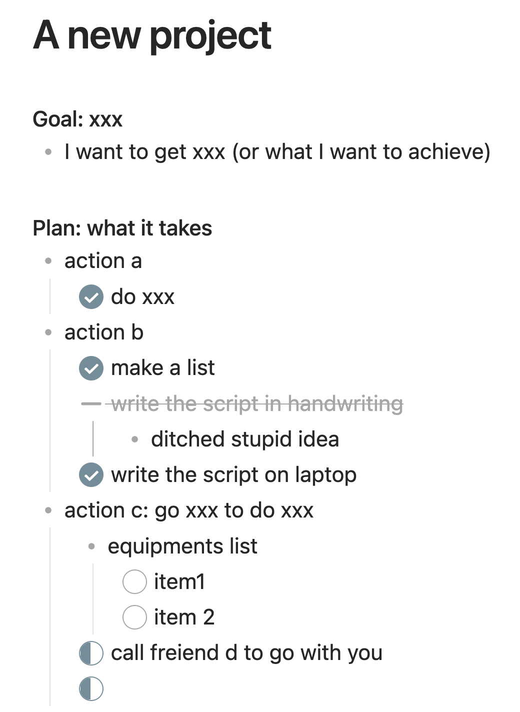
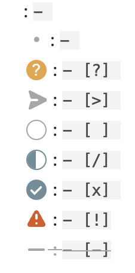

# ToggleList for Obsidian

This is a simple plugin for Obsidian (https://obsidian.md) to overwrite the default behavior of toggle checkbox status. 

## Why this plugin?

### 1. Simple project and task management system

I want to use obsidian as a simple task management tool (as many others are doing), but the existing task management are a little too complex for me. They are still good plugins and thanks the contributors and all the youtubers who teach me how to use. I just want to make obsidian to serve as my __project management tool__ (which I plan the actions to achieve goals, and they are naturally in checkbox style) and __task management tool__ (yup, tasks are checkbox too). While actions should eventually become tasks, they usually are not in the first place. Separating them requires a lot of tagging, dataview query, etc, which I'm really not good at. All I need is a one same hotkey to make a thought to list or actions, and press again, I can make it to current focusing task today.

### 2. A simple fix to my naughty fingers

I triggers "Toggle checkbox" much more than multiple times, some are intentional but most are not. I'm not sure why obsidian team decides we cannot use the same hotkey to covert checkbox back to list or paragraphs, but that's not for me.

__Backgorund__
Toggle behavior of official implementation (Toggle checkbox status, `Cmd`/`Ctrl`+`Enter`) has only two states: `checked` and `unchecked`

```
  - [ ]
  - [x]
```

## What this plugin does?

1. You can define your desire states to circle with `Cmd`/`Ctrl` + `Enter`.
2. Nothing else.
3. While I'm not going to implement this, the script in this discussion: [Creating tasks that have three possible states instead of two](https://forum.obsidian.md/t/creating-tasks-that-have-three-possible-states-instead-of-two/24105/2) I found on forum is going to make a perfect couple with this plugin. A simple customization for the selfdefined states.

Here's an example project page to show why checkbox needs more states and why using the same hotkey to circle through them are good ideas




## Installation
 
- Download the folder and put in `Vault/.obsidian/plugin`.
- Maybe I'll publish it on the official list someday.

## Usage

1. Enable it in the community plugin tab.
2. Setup the states you want in the states field. All states are concatenated with `;;`. The defaut setup is `;;- ;;- [ ] ;;- [/] ;;- [x] `. This setup represents for states:

  1. paragraphs, nothing but pure text, one of the best features obsidian beats roam-like apps
  2. list
  3. checkbox in todo state
  4. checkbox in a state for anything you want
  5. checkbox in done state

3. Set the hotkey `Cmd`/`Ctrl` + `Enter` for this plugin "ToggleList: ToggleList->Next" you can search the command with the name. Since this hotkey is occupied by the official toggle, you need to delete the hotkey of "Toggle checkbox status" first.

Note that the space after these prefixes is important. You need "- [ ] " to make a checkbox.

## ~~Advanced setup~~ Other things to make it beautiful

As I mentioned, custom `css` are required to make those non-standard notations work. And after finishing this plugin, I surpriely find out the theme I'm using: [Minimal](https://github.com/kepano/obsidian-minimal) supports a lot of cool icons for special styled lists (love you [kapano](https://www.buymeacoffee.com/kepano) <3 ). Here's how you can enable them all.

1. Install and enable the "Minimal" Theme from Apperance.
2. Replace the default states field with
  ```
    - ;;- [ ] ;;- [/] ;;- [x] ;;- [>] ;;- [?] ;;- [!] ;;- [-] ;;
  ```
How it looks like:




While it's cool, I need to remind you that too many states will make you hard to get back. (9 hotkey press requied to go back to the inital state in this example)